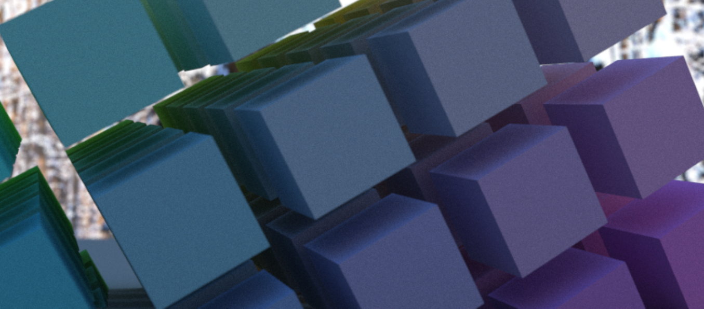
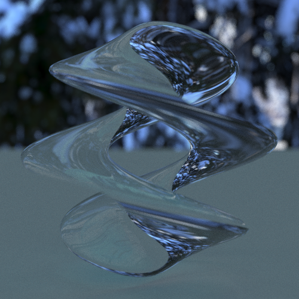
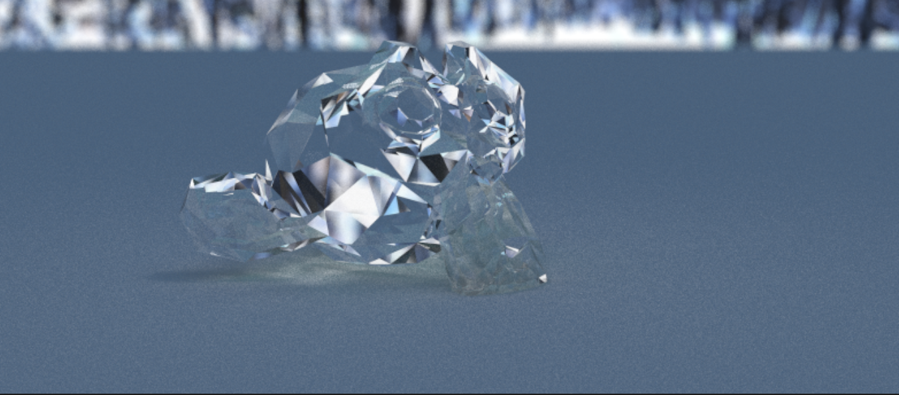
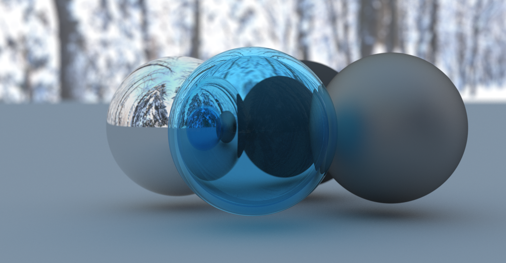
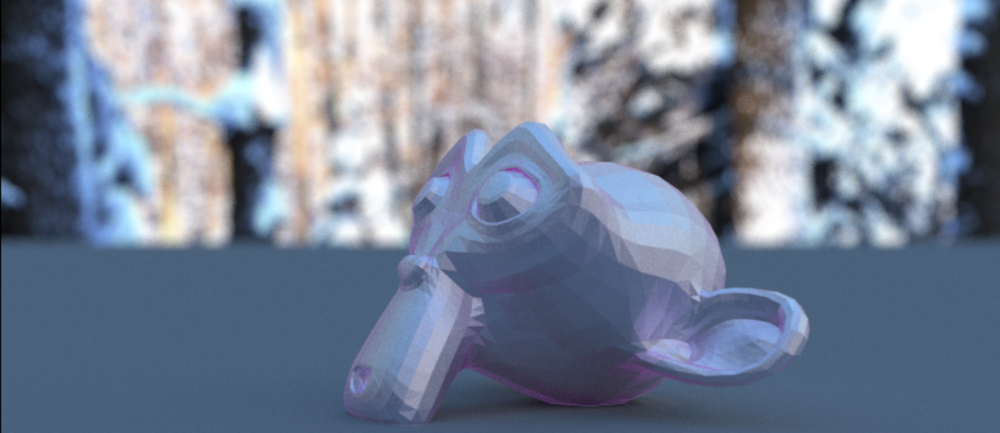

# Heliochrome
Heliochrome is a CPU ray tracer written in rust. This was initially adapted from Peter Shirley's [Ray Tracing in One Weekend Series](https://raytracing.github.io/), and has been extended in my exploration of ray tracing.

## References
* [Ray Tracing in One Weekend Series](https://raytracing.github.io/) (Peter Shirley)
* [Inigo Quilez's whole site](https://iquilezles.org/) (Inigo Quilez)
* [https://64.github.io/tonemapping/](https://64.github.io/tonemapping/) (Matt Taylor)

## Features
* Semi-real time previewing of renders using a cumulative image buffer
* Mesh primitive and loading from obj files
* SDF primitive
* linear transforms using matrices and a custom maths module
* hdri equirectangular skyboxes
* Tone mapping using Hable, Reinhard, Hejl-Richard, and ACES

## Results

    
     cubes, 200 samples 
    
     swirlyboi, 300 samples 
    
     glass suzanne, 500 samples 
    
     orbs, 1200 samples 
    
     suzanne, 400 samples 

